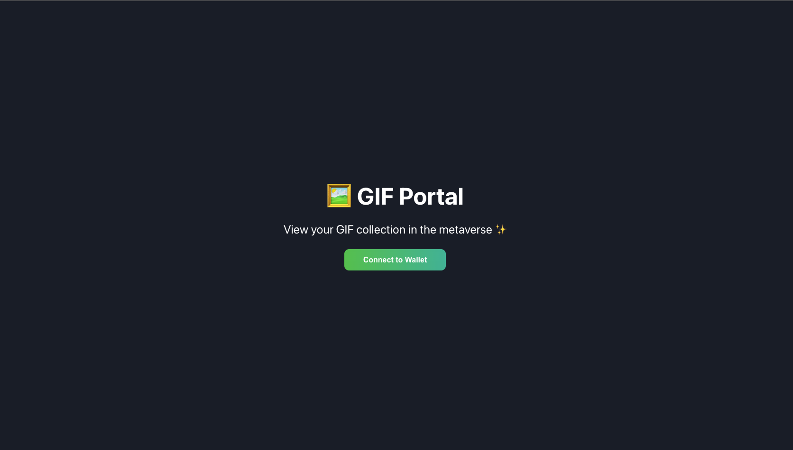
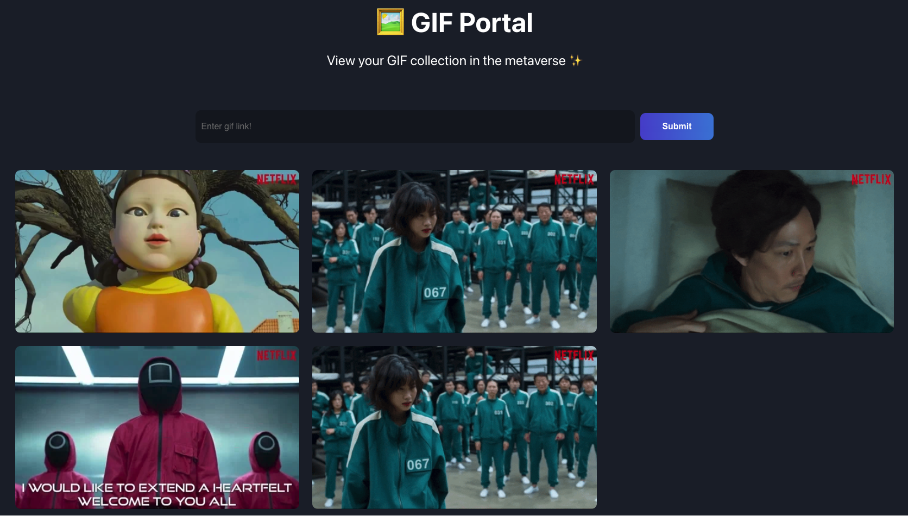

# buildspace Solana GIF Portal Project
This is a project from buildspace for the [Build a Web3 app on Solana with React and Rust](https://app.buildspace.so/projects/CObd6d35ce-3394-4bd8-977e-cbee82ae07a3).

Run `npm install` at the root of your directory  
Run `npm run start` to start the project

### Section 1 - Get your web app connected to a Solana wallet
In order for the website to talk to Solana program, we need to connect our wallet to it. We can use the Phantom wallet extension to accomplish this. The phantom wallet will inject a ```solana``` object on the ```window``` in Javascript, which allows us to access solana functions.

In utils/wallet-utils.js, I have code that verifies that the ```window.solana``` object exists and that the wallet is authorized to access the user's wallet. If the user is not authorized to access the wallet, then we need to request the user to connect their wallet with a "Connect to Wallet" button defined in App.js.

Once the user is authorized, then the GIFs should start showing on the app, and the user should also be able to input URLs and add more GIFs on the front-end!

What the UI looks like if not connected:


What the UI looks like once connected:


### Section 2 - Write a Solana program
Follow [this](https://github.com/buildspace/buildspace-projects/blob/main/Solana_And_Web3/en/Section_2/Resources/m1_setup.md) guide to setup a local Solana environment on an M1 Macbook.

We will be using the Anchor framework in Rust to run Solana programs locally and deploy them to the actual Solana blockchain. The Rust service source code is under the service folder. The Javascript code on the Anchor app is used to call the Rust program and to test with the solana-test-validator.

In lib.rs, we create two Solana transactions under the functions start_stuff_off and add_gif. The first function initializes the total gifs counter. The second function adds a new GIF item and increments the total gifs counter.

In the service/tests.service.js file, you'll see a unit test we created that communicates with our Solana program that is deployed onto the local validator node. The whole deployment and communication process is done thanks to Anchor! You can run the tests by running ```anchor test```.

Notice that whenever your run ```anchor test``` the GIF count resets back to 0, this is because ```anchor.web3.Keypair.generate()``` generates a new key pair for our account, which
creates a new account each time. This is useful for testing purposes since we can start with a fresh new account each time we test.

### Section 3 - Deploy + connect Solana program to web app
Let's deploy our Solana program to the devnet, which is a network run by Solana that runs on fake SOL. We need to make sure to update our Anchor.toml to be for devnet, get and update the program id, and build the anchor project. This is all detailed on the buildspace guide, so follow that.

The program id is BKnPxrqZnF5Sss6eGokwTAboVnXihNjeagR5qNAzR12D, which you can view in the [Solana Explorer](https://explorer.solana.com/address/BKnPxrqZnF5Sss6eGokwTAboVnXihNjeagR5qNAzR12D?cluster=devnet). Scroll to the "Transaction History", and you can see the deployments to the Solana program right there.

Whenever you run ```anchor test``` on the devnet Keypair, it will create new transactions shown on the "Transaction History". Each time you run ```anchor test```, it actually re-deploys the program on Solana. The reason for this is because Solana programs are upgradeable, so it always uses the latest version of the program. This implies that we can upgrade programs while keeping the account data related to the program, unlike Etherum where you can never change a smart contact once it's deployed.

When running ```anchor build```, it outputs an idl file under target/idl/service.json that contains the names of our functions and the parameters they accept. This helps our web app to interact with our deployed program. I copied that idl file into a file called idl.json in the src folder of my React app. This allows the React app to communicate with the Solana program. Make sure to update the idl.json file each time we redeploy the Anchor service.

This section goes over connecting Solana to our Wallet. The getProvider function provided in utils/solana-utils.js is the connection between the Wallet and Solana itself. The constants in constants/solana.js are the configurations from our Solana program.

The baseAccount variable in constants/solana.js is the key pair of the account, so our Solana program will receive an account associated with that key pair. The script under scripts/create-key-pair.js will create a key pair stored in the keypair.json file. The baseAccount variable always loads the keypair.json, so this ensures there's only one account for the GIF list used among all users of the app.
- Key pairs are a very important concept because it can help us create a single shared account for the entire application or individual accounts for each single user
  - If we want a shared account, then we create one public keypair for everyone to use
  - If we want an individual account for each user, then we create a keypair per user and ensure the user that owns its keypair can only access that keypair's private key

